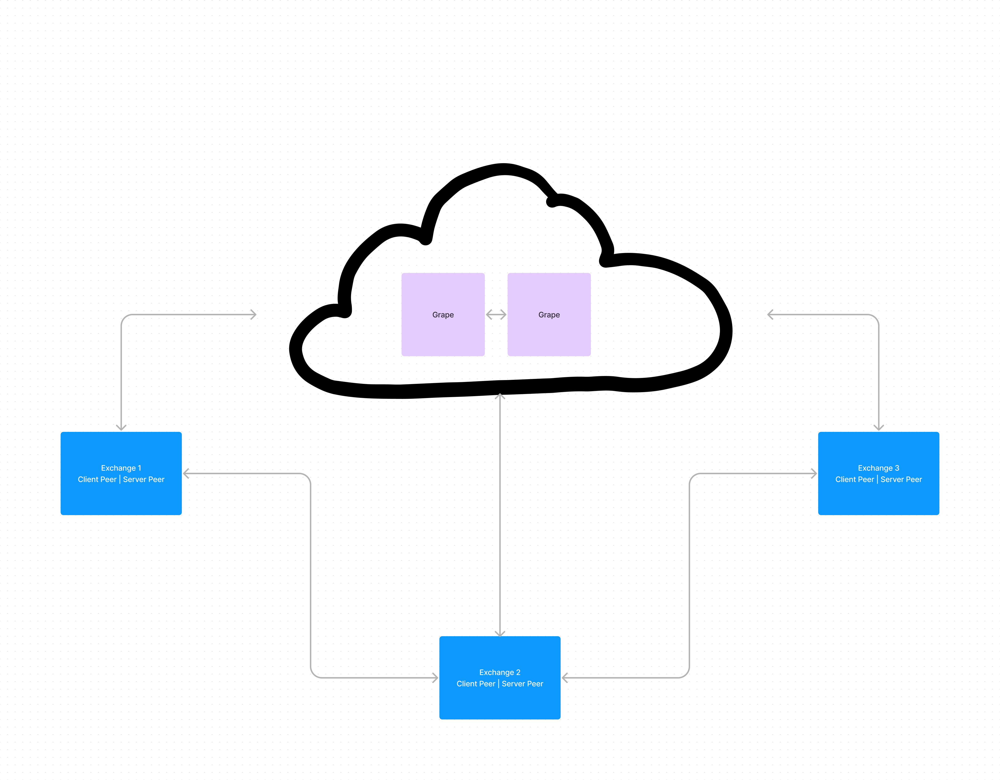

## Challenge

Your task is to create a simplified P2P distributed exchange:

- Each client will have its own instance of the orderbook.
- Clients submit orders to their own instance of orderbook. The order is distributed to other instances, too.
- If a client's order matches with another order, any remainer is added to the orderbook, too.

Requirement:

- Code in Javascript
- Use Grenache for communication between nodes
- Simple order matching engine
- You don't need to create a UI or HTTP API

 Tips:

- you don't need to store state in a DB or filesystem
- it is possible to solve the task with the node std lib, async and grenache libraries
- beware of race conditions!
- no need for express or any other http api layers

## High Level Architecture
We have implemented a DHT with 2 grapes and 3 peers. Each peer interacts with the other peers using RPC. The grape is used to discover other peers in the network and to communicate with them.

Each peer in the network acts an exchange maintaining its own orderbook. When a new order is submitted, the exchange tries to fulfil the order by itself, if it cannot then the order is broadcasted to all other peers in the network. Each peer in the network will find as many matches in their orderbook as possible and return them to the original peer. The original peer will then try to fulfil the order with the matches returned by the other peers in sequence until the list of matched orders is empty.



## Activity Diagram


#### Control Flow of the system

Each peer is termed as an exchange and has both a client and a server for 2-way communication using RPC.

Here is a detailed control flow of the system:

  1. Order is submitted to the exchange 1
  2. Exchange 1 tries to fulfil the order with its own orderbook
  3. If the order is not fulfilled, the order is broadcasted to the network using a broadcast key `broadcast` mapping over all clients.
  4. The order is received by exchange 2 and 3
  5. Exchange 2 and 3 find matches in their orderbook and return the matches to exchange 1 using the `ORDER_MATCHED` messageType to the original peer.
  6. Matched orders are added to a queue
  7. Exchange 1 finds the queue as non-empty and starts processing the queue of matched orders
  8. Exchange 1 iterates over the matched orders
  9. Every matched order is first fulfilled with its original peer using `FILL_ORDER` and then the original order is updated with the remaining quantity.
  10. This process continues until the matched orders are exhausted.


## Models

### Order

```json
{
  "id": "string",
  "item": "string",
  "type": "string", // buy or sell
  "price": "number",
  "peerId": "string",
  "quantity": "number",
  "originalQuantity": "number",
  "filledQuantity": "number",
  "matchedOrders": [] // list of orders that matched this order
}
```

### Orderbook

```json
{
  "buyOrders": [] // list of buy orders
  "sellOrders": [] // list of sell orders
  "filledOrders": [] // list of filled orders
}
```

## How to run

1. Clone the repository
2. Run `npm install`
3. Run `npm run start:grapes` to start the grape server
4. Run peers (first argument is the port and the second argument is to select a demo transaction to execute)
    - node index.js 1336
    - node index.js 1337 1
    - node index.js 1338 2
    - node index.js 1339 3


## Improvements

- Allow placing orders through API or an external interface
- Rebroadcast orders to the network if they are not fulfilled after a certain time
- Migrate orderbook to a database for persistence
- Add validations for RPC communications, and orders
- Add better error handling with enums for error codes
- Fix crashing of clients when the servers are down
- Add retries for RPC communications


